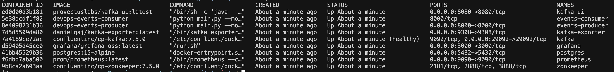
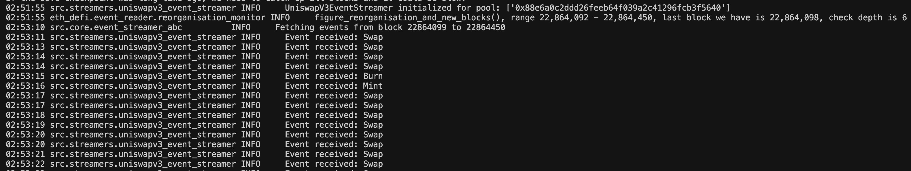

# Uniswap V3 Event Streamer

A event-driven data architecture for streaming Uniswap V3 events from the Ethereum blockchain. This project provides a robust, scalable solution for real-time monitoring and processing of Uniswap V3 swap, mint, and burn events using Apache Kafka for event streaming and checkpointing for fault tolerance.

## 🎯 Overview

The Uniswap V3 Event Streamer is designed to capture and process blockchain events in real-time.
The project implements an event-driven architecture that can handle blockchain reorganizations and maintain state across restarts.
Also there is a observability/monitoring stack that aims to show metrics about the pipeline. 

## 🏗️ Architecture

### Core Components

- **Event Streamer Base Class**: Abstract base class providing common functionality for blockchain event streaming
- **Uniswap V3 Streamer**: Specialized implementation for Uniswap V3 events (swap, mint, burn)
- **Kafka Event Consumer**: Dedicated consumer class for processing events without blockchain overhead
- **Kafka Integration**: Apache Kafka for event streaming and message queuing
- **Checkpointing System**: CSV-based block state persistence for fault tolerance
- **Reorganization Monitor**: Handles blockchain forks and reorganizations automatically
- **Prometheus Metrics**: Built-in monitoring and observability
- **PostgreSQL DB**: SQLAlchemy-based data models for persistent event storage

### Key Features

- **Real-time Event Streaming**: Continuously monitors Uniswap V3 pools for events
- **Fault Tolerance**: Automatic recovery from failures with checkpoint-based state management
- **Blockchain Reorg Handling**: Robust handling of Ethereum chain reorganizations
- **Scalable Architecture**: Producer/Consumer pattern with Kafka for horizontal scaling
- **Comprehensive Event Decoding**: Rich event data including token details, pool information, and timestamps
- **Monitoring & Observability**: Prometheus metrics for API calls, reorgs, and system health, Grafana for Dashboards
- **Persistent Storage**: PostgreSQL database with optimized SQLAlchemy models for event data

## 🚀 Getting Started

### Prerequisites

1. Python 3.12+
2. Docker & Docker Compose
Ensure Docker and Docker Compose are installed on your system. These tools are necessary to manage containers and orchestrate services.
3. UV (Dependency Management) - [Download](https://docs.astral.sh/uv/getting-started/installation/)

### Installation

1. Clone the repository:
```bash
git clone <repository-url>
cd 0x-uniswap-event-streamer
```

2. Install dependencies (Option, only if you want to run locally, not inside a docker container):
```bash
uv venv && source .venv/bin/activate
```

3. Set up environment variables:
```bash
cp .env.example .env
# Edit .env with your configuration
```

### Configuration

Required environment variables:
```bash
# Application Configuration
JSON_RPC_URL=https://rpc.test
POOL_ADDR=address
LOG_LEVEL=info

# PostgreSQL Configuration
POSTGRES_HOST=localhost
POSTGRES_PORT=5432
POSTGRES_USER=admin
POSTGRES_PASSWORD=admin
POSTGRES_DB=eventstream

# Grafana Configuration
GRAFANA_ADMIN_USER=admin
GRAFANA_ADMIN_PASSWORD=admin

# Kafka Configuration
KAFKA_BOOTSTRAP_SERVER=localhost:29092
```

### How to execute this Project?

This project it was implemented to run using docker containers, and for that it was used `docker-compose`. 
When running the project locally you have two different modes to run it. The first one is entire using `docker-compose` and 
the second one is more indicated for debug purposes, basically all the services needed are deployed using `docker-compose`, however
the script to stream and consume the events will be executed in the host, not in a container. This second mode require some manual steps 
due `docker-compose` limitations.

#### 📊 Event Types

The project supports streaming of the following Uniswap V3 events:

- **Swap Events**: Token swaps with detailed pricing and liquidity information
- **Mint Events**: New liquidity position creation
- **Burn Events**: Liquidity position removal

##### Flexible Event Filtering

You can stream individual events or all events simultaneously:

- **Single Event**: `--event swap` - Stream only swap events
- **All Events**: `--event all` - Stream all event types (swap, mint, burn)
- **Individual Events**: `--event mint` or `--event burn` - Stream specific event types

### Event Data Structure

Each event includes comprehensive metadata:
- Pool details (tokens, fees, addresses)
- Token information (symbols, decimals, total supply)
- Transaction details (block number, timestamp)
- Decoded event parameters
- Event type identification

The project preserves both raw blockchain data and decoded event information. Here's an example of a Swap event as it appears in Kafka:

```json
{
	"raw_event": {
		"address": "0x88e6a0c2ddd26feeb64f039a2c41296fcb3f5640",
		"topics": [
			"0xc42079f94a6350d7e6235f29174924f928cc2ac818eb64fed8004e115fbcca67",
			"0x00000000000000000000000066a9893cc07d91d95644aedd05d03f95e1dba8af",
			"0x00000000000000000000000066a9893cc07d91d95644aedd05d03f95e1dba8af"
		],
		"data": "0x000000000000000000000000000000000000000000000000000000001ee73afffffffffffffffffffffffffffffffffffffffffffffffffffd37dccd4dbd41c70000000000000000000000000000000000004cd36e4371ad3f5ee7344240f2b000000000000000000000000000000000000000000000000025e5d6f904d115550000000000000000000000000000000000000000000000000000000000030470",
		"blockHash": "0x7fc2c0514b58bb05985bfe462f2df53668f4b712f7eeab1cc5b33caaff9ab450",
		"blockNumber": 22864697,
		"blockTimestamp": "0x686b41e3",
		"transactionHash": "0x42c49b167fff2b97d1cd0f8af50111e27fafa88bac3104142c7eb411e703e152",
		"transactionIndex": "0x18",
		"logIndex": "0xc2",
		"removed": false,
		"context": null,
		"chunk_id": 22864697,
		"timestamp": 1751859683,
		"event_name": "Swap",
		"record_timestamp": "2025-07-07T03:42:52"
	},
	"decoded_event": {
		"block_number": 22864697,
		"timestamp": "2025-07-07T03:41:23",
		"tx_hash": "0x42c49b167fff2b97d1cd0f8af50111e27fafa88bac3104142c7eb411e703e152",
		"log_index": 194,
		"pool_contract_address": "0x88e6a0c2ddd26feeb64f039a2c41296fcb3f5640",
		"amount0": 518470399,
		"amount1": -200448884064042553,
		"sqrt_price_x96": 1558214397053970255220248800195248,
		"liquidity": 2730825114086085973,
		"tick": 197744,
		"event_name": "Swap",
		"pool_details": "Pool 0x88e6A0c2dDD26FEEb64F039a2c41296FcB3f5640 is USDC-WETH, with the fee 0.0500%",
		"pool_fee": 0.0005,
		"token0_address": "0xA0b86991c6218b36c1d19D4a2e9Eb0cE3606eB48",
		"token1_address": "0xC02aaA39b223FE8D0A0e5C4F27eAD9083C756Cc2",
		"token0_symbol": "USDC",
		"token1_symbol": "WETH",
		"token0_decimals": 6,
		"token1_decimals": 18,
		"token0_name": "USD Coin",
		"token1_name": "Wrapped Ether",
		"token0_total_supply": 41372662655014001,
		"token1_total_supply": 2632330049017048166323257,
		"record_timestamp": "2025-07-07T03:42:52"
	}
}
```

The idea to keep also the raw data is for possible uses cases where we want to use a different decode or execute a backfill process.

**Key Features of the Event Structure:**
- **Raw Event**: Preserves the original blockchain log data including topics, data field, and transaction metadata
- **Decoded Event**: Human-readable event data with decoded parameters, token information, and pool details
- **Comprehensive Metadata**: Includes both technical blockchain data and business-relevant information like token symbols, pool fees, and liquidity details

#### 🐳 Docker Deployment

To run all the services you can use this command from the `Makefile`:

```bash
make compose-up
```

This command will start all the services and run the events producer and events consumer.

Services:

- **postgres**: PostgreSQL database for storing event data and application state
- **zookeeper**: Coordination service for Kafka cluster management and metadata storage
- **kafka**: Apache Kafka message broker for event streaming and distributed messaging
- **kafka-ui**: Web-based user interface for monitoring and managing Kafka topics, consumers, and producers
- **kafka-exporter**: Prometheus exporter that exposes Kafka metrics for monitoring and alerting
- **prometheus**: Time-series database and monitoring system for collecting and querying metrics
- **grafana**: Data visualization and analytics platform for creating dashboards from Prometheus metrics
- **events-producer**: Application container that streams Uniswap V3 events from blockchain to Kafka
- **events-consumer**: Application container that processes events from Kafka and stores them in PostgreSQL


When you run this command you see all the containers, just run this command:

```bash
docker ps -a
```

This will show this output:


You can check the containers logs to see which events are being produced. 

```bash
docker logs -f events-producer
```

Then you will see this logs from the container. In this case you can see the events that was received:




#### Host Deployment

This the option for when we need to run the project in the host for debug purposes.

The first thing you need to execute is deploy only the services you need except the events producer and events consumer, because these ones
you will run directly in the host.

Run this command:

```bash
make compose-up-services
```

Now you can run the project in the host for test purposes or debug.

#### Producer Mode (Event Streaming)

Stream a single event type:
```bash
python main.py --mode producer --event swap
```

Stream all event types:
```bash
python main.py --mode producer --event all
```

#### Consumer Mode (Event Processing)

```bash
python main.py --mode consumer
```


## 📈 Monitoring & Observability

The project includes a comprehensive monitoring stack with multiple tools for observability:

### Prometheus Metrics

The application exposes Prometheus metrics on different ports:

#### Producer Metrics (Port 8000)
- **`chain_reorganizations_total`** (Counter): Total number of blockchain chain reorganizations (forks) detected since startup
  - Labels: `chain_id` (ethereum, polygon, arbitrum, etc.)

- **`api_requests_total`** (Gauge): Total number of JSON-RPC API requests made to the blockchain node
  - Labels: `chain_id` (ethereum, polygon, arbitrum, etc.)

- **`produced_events_total`** (Counter): Total number of events produced to Kafka
  - Labels: `event_name` (swap, mint, burn)

- **`produced_events_latency`** (Gauge): Latency of events produced to Kafka
  - Labels: `event_name` (swap, mint, burn)

#### Consumer Metrics (Port 8001)
- **`events_processed_total`** (Counter): Total number of events processed since startup
  - Labels: `event_name` (swap, mint, burn)

- **`events_processed_latency`** (Gauge): Latency of events processed since block timestamp
  - Labels: `event_name` (swap, mint, burn)

- **`last_event_processed_timestamp`** (Gauge): Timestamp of the last successfully processed event
  - Labels: `event_name` (swap, mint, burn)

- **`processing_errors_total`** (Counter): Total number of processing errors since startup
  - Labels: `error_type` (kafka_consumer_error, event_decode_error, json_decode_error, processing_error)

### Example Prometheus Queries

```promql
# Rate of chain reorganizations per minute
rate(chain_reorganizations_total[1m])

# API request rate per minute
rate(api_requests_total[1m])

# Events production rate per minute
rate(produced_events_total[1m])

# Events processing rate per minute
rate(events_processed_total[1m])

# Average event processing latency
avg(events_processed_latency)

# Error rate per minute
rate(processing_errors_total[1m])
```

### Metrics Endpoints

- Producer metrics: `http://localhost:8000/metrics`
- Consumer metrics: `http://localhost:8001/metrics`
- Prometheus: `http://localhost:9090`
- Grafana: `http://localhost:3000` (admin/admin)
- Kafka UI: `http://localhost:8080`

### Grafana Dashboards

The project includes Grafana dashboards for comprehensive monitoring:

- **Kafka Metrics Dashboard**: Real-time monitoring of event production/consumption rates, latency, chain reorganizations, and Kafka cluster health
- **Key Metrics Tracked**:
  - Events produced/consumed per minute
  - Total events processed
  - Event processing latency
  - Chain reorganization count
  - API request totals
  - Kafka consumer group health
  - Topic partition status

<video src="https://github.com/l-jhon/0x-uniswap-event-streamer/blob/37d09383137dbfa9b57f89ceaa919d40530e2182/docs/grafana.mp4"controls width="600"></video>  


### Kafka UI

A web-based interface for Kafka cluster management and monitoring:

- **Topic Management**: View and manage Kafka topics
- **Consumer Groups**: Monitor consumer group status and offsets
- **Message Browsing**: Browse messages in topics
- **Cluster Health**: Monitor broker status and configuration
- **Real-time Metrics**: View Kafka cluster performance metrics

<video src="https://github.com/l-jhon/0x-uniswap-event-streamer/blob/37d09383137dbfa9b57f89ceaa919d40530e2182/docs/kafka_ui.mp4" controls width="600"></video>

## 🔧 Development

### Project Structure
```
src/
├── core/
│   └── event_streamer_abc.py    # Abstract base class for event streaming
├── models/
│   ├── base.py                  # Base model and UUID generation
│   ├── swap_events.py           # SQLAlchemy model for swap events
│   ├── mint_events.py           # SQLAlchemy model for mint events
│   └── burn_events.py           # SQLAlchemy model for burn events
├── streamers/
│   ├── uniswapv3_event_streamer.py # Uniswap V3 implementation
│   └── kafka_consumer.py        # Dedicated Kafka consumer
└── utils/
    ├── datetime_encoder.py      # JSON datetime serialization
    ├── filesystem.py            # File system utilities
    ├── kafka.py                 # Kafka setup utilities
    ├── logger.py                # Logging configuration
    ├── postgresql_client.py     # PostgreSQL client with SQLAlchemy
    └── web3.py                  # Web3 setup utilities
```

### Adding New Event Types

1. **Extend the Event Models**: Create a new SQLAlchemy model in `src/models/` following the pattern of existing event models
2. **Update Event Streamer**: The `UniswapV3EventStreamer` already supports all Uniswap V3 events (swap, mint, burn)
3. **Update Consumer**: Add handling for the new event type in `KafkaEventConsumer._handle_message()`
4. **Add Event Decoding**: Ensure the event is properly decoded in the `decode_event` method

### Database Schema

The project uses SQLAlchemy ORM with optimized models for each event type:

- **SwapEvent**
- **MintEvent**
- **BurnEvent**

All models include:
- Unique constraints to prevent duplicates
- Optimized indexes for common query patterns
- Comprehensive metadata fields
- Automatic timestamp management

### Testing

```bash
pytest
```

## 🔗 Related Projects

- [eth-defi](https://github.com/tradingstrategy-ai/web3-ethereum-defi): Ethereum DeFi utilities
- [confluent-kafka-python](https://github.com/confluentinc/confluent-kafka-python): Kafka client
- [web3.py](https://github.com/ethereum/web3.py): Ethereum Python library 