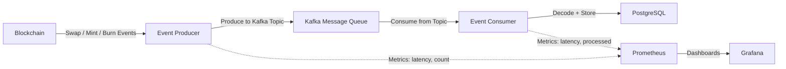
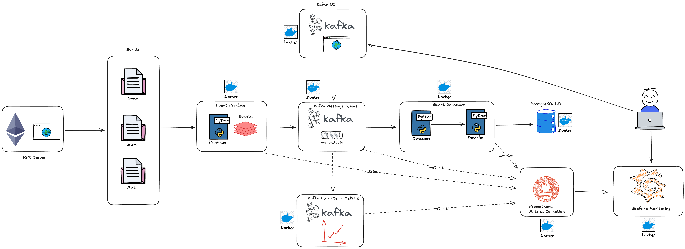
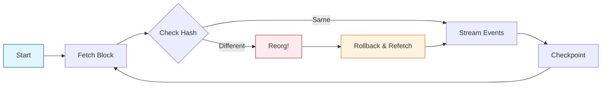

# Uniswap V3 Event Streamer

<div align="center">

[](https://www.python.org/downloads/)
[](https://www.docker.com/)
[](https://kafka.apache.org/)
[](https://www.postgresql.org/)
[](https://prometheus.io/)
[](https://grafana.com/)

**Real-time blockchain event streaming for Uniswap V3 Events (Swap, Mint, Burn)**

[Features](#-features) • [Quick Start](#-quick-start) • [Architecture](#-architecture) • [Implementation Details](#️-implementation-details) • [Monitoring](#-monitoring) • [Documentation](#-documentation)

</div>

---

## 🎯 Overview

The Uniswap V3 Event Streamer is designed to capture and process blockchain events in real-time from one or multiple Uniswap V3 pools. The project implements an event-driven architecture that can handle blockchain reorganizations and maintain state across restarts. Also there is a observability/monitoring stack that aims to show metrics about the pipeline.

There is already a DB dump file with some sample events. [Here is the file.](uniswap_v3_events.dump)

## ✨ Features

<table>
<tr>
<td>

### 🚀 Core Capabilities
- **Real-time Event Streaming** - Continuously monitors Uniswap V3 pools
- **Multi-Pool Support** - Stream events from single or multiple pools simultaneously
- **Fault Tolerance** - Automatic recovery with checkpoint-based state management
- **Blockchain Reorg Handling** - Robust handling of Ethereum chain reorganizations
- **Scalable Architecture** - Producer/Consumer pattern with Kafka

</td>
<td>

### 📊 Monitoring & Storage
- **Comprehensive Metrics** - Prometheus metrics for API calls, reorgs, and health
- **Visual Dashboards** - Pre-configured Grafana dashboards
- **Persistent Storage** - PostgreSQL with optimized SQLAlchemy models
- **Event Decoding** - Rich data including token details and timestamps

</td>
</tr>
</table>

## 🏗️ Architecture

### System Components





### Core Components

| Component | Description |
|-----------|-------------|
| **Event Streamer Base** | Abstract base class providing common functionality for blockchain event streaming |
| **Uniswap V3 Streamer** | Specialized implementation for Uniswap V3 events (swap, mint, burn) |
| **Kafka Consumer** | Dedicated consumer class for processing events without blockchain overhead |
| **Checkpointing System** | CSV-based block state persistence for fault tolerance |
| **Reorganization Monitor** | Handles blockchain forks and reorganizations automatically |

The Reorgs are handle by the framework `eth-defi` used to stream the events. Here is how the framework is handling with reorgs.



## 🛠️ Implementation Details

### Key Technologies

| Technology | Purpose | Why Chosen |
|------------|---------|------------|
| **[eth-defi](https://github.com/tradingstrategy-ai/web3-ethereum-defi)** | Blockchain event streaming | Simplifies DeFi event handling with built-in reorg detection |
| **[SQLAlchemy](https://www.sqlalchemy.org/)** | Database ORM | Clean model definitions and type safety |
| **[Confluent Kafka](https://github.com/confluentinc/confluent-kafka-python)** | Message queue | High-performance, reliable event streaming |
| **[Prometheus + Grafana](https://prometheus.io/)** | Monitoring | Industry-standard observability stack |

### Architecture Patterns

- **Producer/Consumer**: Decoupled event streaming and processing
- **Checkpointing**: Fault-tolerant state management across restarts
- **Event-Driven**: Asynchronous processing for scalability

## 🚀 Quick Start

### Prerequisites

- **Python 3.12+** - [Download](https://www.python.org/downloads/)
- **Docker & Docker Compose** - [Installation Guide](https://docs.docker.com/get-docker/)
- **UV (Dependency Management)** - [Installation](https://docs.astral.sh/uv/getting-started/installation/)

> **Note**: For local development, you'll need Python and UV. For Docker deployment, only Docker and Docker-Compose are required.

### 🐳 Docker Deployment

1. **Clone and Configure**
   ```bash
   git clone <repository-url>
   cd 0x-uniswap-event-streamer
   cp .env.example .env
   # Edit .env with your configuration
   ```

2. **Start All Services**
   ```bash
   make compose-up
   ```

3. **Verify Deployment**
   ```bash
   docker ps -a  # Check all containers are running
   docker logs -f events-producer  # View producer logs
   ```

### 💻 Local Development

For debugging and development, run supporting services in Docker but the application locally:

1. **Start Infrastructure Services**
   ```bash
   make compose-up-services
   ```

2. **Install Dependencies**
   ```bash
   uv venv && source .venv/bin/activate
   ```

3. **Run Producer**
   ```bash
   # Stream specific event type
   python main.py --mode producer --event swap

   # Stream all events
   python main.py --mode producer --event all
   ```

4. **Run Consumer**
   ```bash
   python main.py --mode consumer
   ```

## 🛠️ Makefile Commands

The project includes a Makefile with convenient commands for managing the application:

### Basic Operations
```bash
make build                # Build Docker image
make compose-up           # Start all services with docker-compose
make compose-down         # Stop all services
make compose-logs         # Show logs from all services
```

### Development Commands
```bash
make compose-up-services  # Start infrastructure only (no producer/consumer)
make compose-rebuild      # Start services with force rebuild
```

### Maintenance Commands
```bash
make reset-consumer-offset # Reset Kafka consumer group offset
make clean-up             # Complete cleanup (stop, remove volumes, delete image)
make help                 # Show all available commands
```

> **Tip:** Use `make help` to see all available commands with descriptions.

## ⚙️ Configuration

### Environment Variables

```bash
# Application Configuration
JSON_RPC_URL=https://rpc.test
POOL_ADDRESSES=address               # Pool address(es) - single or comma-separated
LOG_LEVEL=info
```

#### Pool Configuration Examples

**Single Pool:**
```bash
POOL_ADDRESSES=0x88e6a0c2ddd26feeb64f039a2c41296fcb3f5640
```

**Multiple Pools:**
```bash
POOL_ADDRESSES=0x88e6a0c2ddd26feeb64f039a2c41296fcb3f5640,0x6c6Bc977E13Df9b0de53b251522280BB72383700,0x8ad599c3a0ff1de082011efddc58f1908eb6e6d8
```

> **Note:** The script automatically detects if you're using a single pool or multiple pools based on the presence of commas.

```bash
# PostgreSQL Configuration
POSTGRES_HOST=localhost
POSTGRES_PORT=5432
POSTGRES_USER=admin
POSTGRES_PASSWORD=admin
POSTGRES_DB=eventstream

# Grafana Configuration
GRAFANA_ADMIN_USER=admin
GRAFANA_ADMIN_PASSWORD=admin

# Kafka Configuration
KAFKA_BOOTSTRAP_SERVER=localhost:29092
```

### Supported Event Types

| Event Type | Description | Command Flag |
|------------|-------------|--------------|
| **Swap** | Token swaps with pricing and liquidity info | `--event swap` |
| **Mint** | New liquidity position creation | `--event mint` |
| **Burn** | Liquidity position removal | `--event burn` |
| **All** | Stream all event types simultaneously | `--event all` |

## 📊 Event Data Structure

Each event includes comprehensive metadata. Here's an example Swap event:

<details>
<summary>Click to expand example event</summary>

```json
{
  "raw_event": {
    "address": "0x88e6a0c2ddd26feeb64f039a2c41296fcb3f5640",
    "topics": [
      "0xc42079f94a6350d7e6235f29174924f928cc2ac818eb64fed8004e115fbcca67",
      "0x00000000000000000000000066a9893cc07d91d95644aedd05d03f95e1dba8af",
      "0x00000000000000000000000066a9893cc07d91d95644aedd05d03f95e1dba8af"
    ],
    "data": "0x000000000000000000000000000000000000000000000000000000001ee73aff...",
    "blockHash": "0x7fc2c0514b58bb05985bfe462f2df53668f4b712f7eeab1cc5b33caaff9ab450",
    "blockNumber": 22864697,
    "blockTimestamp": "0x686b41e3",
    "transactionHash": "0x42c49b167fff2b97d1cd0f8af50111e27fafa88bac3104142c7eb411e703e152",
    "transactionIndex": "0x18",
    "logIndex": "0xc2",
    "removed": false,
    "event_name": "Swap",
    "record_timestamp": "2025-07-07T03:42:52"
  },
  "decoded_event": {
    "block_number": 22864697,
    "timestamp": "2025-07-07T03:41:23",
    "tx_hash": "0x42c49b167fff2b97d1cd0f8af50111e27fafa88bac3104142c7eb411e703e152",
    "log_index": 194,
    "pool_contract_address": "0x88e6a0c2ddd26feeb64f039a2c41296fcb3f5640",
    "amount0": 518470399,
    "amount1": -200448884064042553,
    "sqrt_price_x96": 1558214397053970255220248800195248,
    "liquidity": 2730825114086085973,
    "tick": 197744,
    "event_name": "Swap",
    "pool_details": "Pool 0x88e6A0c2dDD26FEEb64F039a2c41296FcB3f5640 is USDC-WETH, with the fee 0.0500%",
    "pool_fee": 0.0005,
    "token0_symbol": "USDC",
    "token1_symbol": "WETH",
    "token0_decimals": 6,
    "token1_decimals": 18,
    "token0_name": "USD Coin",
    "token1_name": "Wrapped Ether",
    "record_timestamp": "2025-07-07T03:42:52"
  }
}
```

</details>

The idea to keep also the raw data is for possible uses cases where we want to use a different decode or execute a backfill process.

## 📈 Monitoring

### 🔍 Metrics Overview

<table>
<tr>
<td>

#### Producer Metrics (Port 8000)
- `chain_reorganizations_total` - Blockchain reorgs detected
- `api_requests_total` - JSON-RPC API requests
- `produced_events_total` - Events sent to Kafka
- `produced_events_latency` - Production latency

</td>
<td>

#### Consumer Metrics (Port 8001)
- `events_processed_total` - Events processed
- `events_processed_latency` - Processing latency
- `last_event_processed_timestamp` - Last event time
- `processing_errors_total` - Processing errors

</td>
</tr>
</table>

### 📊 Monitoring Stack

| Service | URL | Purpose |
|---------|-----|---------|
| **Prometheus** | http://localhost:9090 | Metrics collection and querying |
| **Grafana** | http://localhost:3000 | Dashboards and visualization (admin/admin) |
| **Kafka UI** | http://localhost:8080 | Kafka cluster management |

### 🎬 Demo Videos

#### Grafana Dashboard
https://github.com/user-attachments/assets/71fb0000-8cf9-47e9-98b7-90cd926a0235

#### Kafka UI
https://github.com/user-attachments/assets/44d69ec6-a4a2-4881-a076-802d130f3d41

### Example Prometheus Queries

```promql
# Events production rate per minute
rate(produced_events_total[1m])

# Average event processing latency
avg(events_processed_latency)

# Error rate per minute
rate(processing_errors_total[1m])
```

## 🔧 Development

### Project Structure

```
src/
├── core/
│   └── event_streamer_abc.py        # Abstract base class
├── models/
│   ├── base.py                      # Base model and UUID generation
│   ├── swap_events.py               # Swap event model
│   ├── mint_events.py               # Mint event model
│   └── burn_events.py               # Burn event model
├── streamers/
│   ├── uniswapv3_event_streamer.py  # Uniswap V3 implementation
│   └── kafka_consumer.py            # Kafka consumer
└── utils/
    ├── datetime_encoder.py          # JSON datetime serialization
    ├── filesystem.py                # File system utilities
    ├── kafka.py                     # Kafka setup
    ├── logger.py                    # Logging configuration
    ├── postgresql_client.py         # PostgreSQL client
    └── web3.py                      # Web3 setup
```

### Adding New Event Types

1. **Create Model** - Add SQLAlchemy model in `src/models/`
2. **Update Consumer** - Add handling in `KafkaEventConsumer._handle_message()`
3. **Add Decoding** - Ensure proper decoding in `decode_event` method
4. **Update Metrics** - Add relevant Prometheus metrics

### Database Schema

All event models include:
- ✅ Unique constraints to prevent duplicates
- ✅ Optimized indexes for query patterns
- ✅ Comprehensive metadata fields
- ✅ Automatic timestamp management

### Running Tests

```bash
pytest
```

## 📚 Documentation

### Services Overview

| Service | Description |
|---------|-------------|
| **postgres** | PostgreSQL database for event storage |
| **zookeeper** | Kafka cluster coordination |
| **kafka** | Apache Kafka message broker |
| **kafka-ui** | Web UI for Kafka management |
| **kafka-exporter** | Prometheus metrics for Kafka |
| **prometheus** | Time-series metrics database |
| **grafana** | Metrics visualization platform |
| **events-producer** | Blockchain event streamer |
| **events-consumer** | Event processor and storage |

### Container Management

```bash
# View all containers
docker ps -a

# View producer logs
docker logs -f events-producer

# View consumer logs
docker logs -f events-consumer

# Stop all services
make compose-down
```

## Alternatives

There are some alternatives to traditional RPC calls for building event-driven blockchain architectures:

### 1. HyperSync

An ultra-fast API for blockchain data retrieval that delivers transformative performance improvements.

#### Performance Benchmarks

| Task | Traditional RPC | HyperSync | Improvement |
|------|----------------|-----------|-------------|
| Scan Arbitrum blockchain for sparse log data | Hours/Days | 2 seconds | ~2000x faster |
| Fetch all Uniswap v3 PoolCreated events | Hours | Seconds | ~500x faster |

#### Use Cases
- **Indexers**: Build high-performance data indexers with minimal infrastructure
- **Data Analytics**: Perform complex on-chain analysis in seconds instead of days
- **Block Explorers**: Create responsive explorers with comprehensive data access
- **Monitoring Tools**: Track blockchain activity with near real-time updates
- **Cross-chain Applications**: Access unified data across multiple networks
- **ETL Pipelines**: Create pipelines to extract and save data fast

📖 [HyperSync Documentation](https://docs.envio.dev/docs/HyperSync/overview)

### 2. Shovel

An open-source tool for synchronizing Ethereum data to PostgreSQL databases.

#### Features
- **Multi-chain Support**: Ethereum, Base, Optimism, Arbitrum, and other EVM chains
- **Flexible Connections**: Connect to hosted nodes (Alchemy, Quicknode) or local nodes (Geth, Reth)
- **Event Decoding**: Decode and save events to PostgreSQL without custom functions
- **Comprehensive Indexing**: Index transactions and block metadata
- **Real-time Sync**: Stay in sync with the latest blocks across many chains
- **Concurrent Backfilling**: Efficiently backfill historical data

📖 [Shovel Documentation](https://indexsupply.com/shovel/)

## 📋 TODO

- [ ] **Improve Unit Tests** - Enhance test coverage and add more comprehensive test cases
- [ ] **Implement Data Quality Checks** - Add validation and monitoring for data integrity
- [x] **Multiple Pools** - Support streaming events from multiple Uniswap V3 pools simultaneously
- [ ] **Design Production Architecture** - Design a production-ready go-to architecture
- [ ] **Cloud Deployment** - Deploy this project on a cloud provider (e.g., AWS)
- [ ] **Infrastructure as Code** - Implement Terraform scripts to deploy it on cloud

---